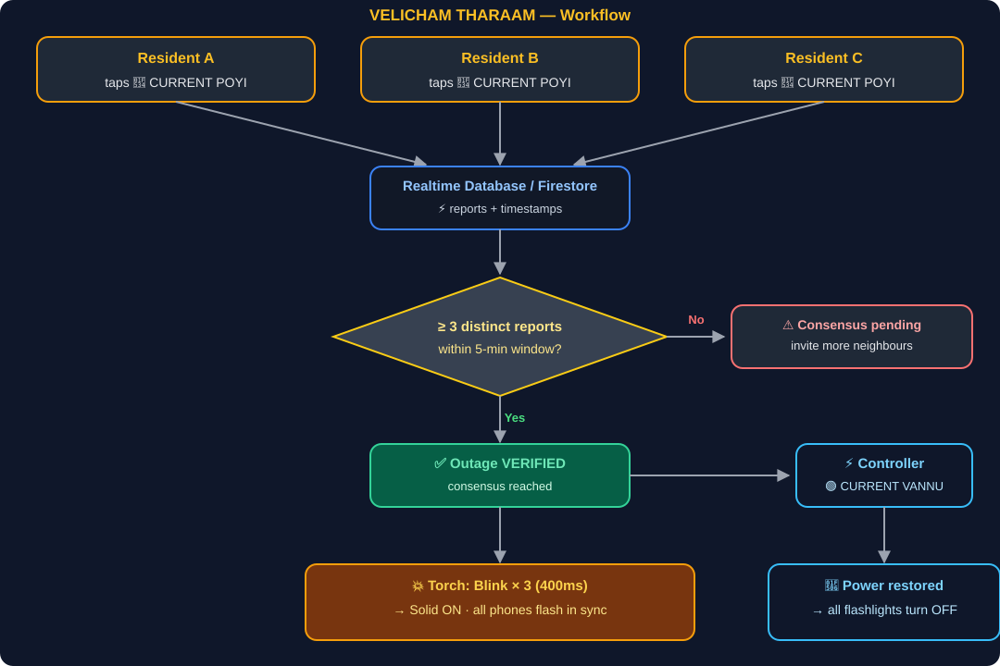

# VELICHAM THARAAM 🔦


## Basic Details
### Team Name: VELICHAM THARAAM


### Team Members
- Team Lead: Neeraj K R - SNMIMT ENGINEERING COLLEGE, ERNAKULAM
- Member 2: Rajaram R S - SNMIMT ENGINEERING COLLEGE, ERNAKULAM


### Project Description
A civic-tech hackathon MVP that turns smartphones into a decentralized emergency lighting network during Kerala power cuts. Residents report outages, nearby neighbours verify them in real time, and every connected phone flashes its torch in sync so the whole locality lights up together.


### The Problem (that doesn't exist)
When the electricity goes out, nobody knows whether it's just your house (a blown fuse / tripped switch) or the entire locality (transformer / substation fault). The only "anonymous survey" available is knocking on your neighbours' doors in the dark.


### The Solution (that nobody asked for)
Tap **🔴 CURRENT POYI**, your neighbours confirm the outage within a 5-minute window, and every phone in the community triggers a synchronized physical flashlight signal — Blink × 3 → Solid ON. A flashlight network you didn't know you needed until the power went out.


## Technical Details
### Technologies/Components Used
For Software:
- React 19 + TypeScript + Vite + Tailwind CSS
- Leaflet + OpenStreetMap (Kerala / Ernakulam focus)
- Firebase Authentication + Firestore / Realtime Database + multi-tab BroadcastChannel sync
- Web MediaStream API (`navigator.mediaDevices.getUserMedia` with `advanced: [{ torch: true }]`) + high-candela screen beacon fallback
- Web Audio API synth tones for emergency alerts and restoration chimes
- Lucide React icons


### Implementation
For Software:
# Installation
```bash
npm install
```


# Run
```bash
npm run dev
```


Open `http://localhost:5173` on your browser or phone on the same local network (`http://<YOUR_IP>:5173`).


### Project Documentation
For Software:


# Screenshots (Add at least 3)

*User Dashboard*


*Control Panel 1*


*Control Panel 2*


# Diagrams

*Outage report → realtime consensus → synchronized torch flash, and the power-restore path*


### Project Demo
# Video
[Demo & UI Review — screen recording](https://drive.google.com/file/d/10WztcHzcPKLiNSdlvSNPsdHi_Ay9Fns7/view?usp=sharing)
*Walkthrough of the outage-report → consensus → synchronized flashlight blink flow*


# Additional Demos
- Live app: https://velicham-tharaam-ad249.web.app


## Team Contributions
- Neeraj K R: App architecture, Firebase realtime consensus & auth, torch / blink synchronization, backend services
- Rajaram R S: UI/UX design, community & outage services, Android integration


---
Made with ❤️ at TinkerHub Useless Projects 


